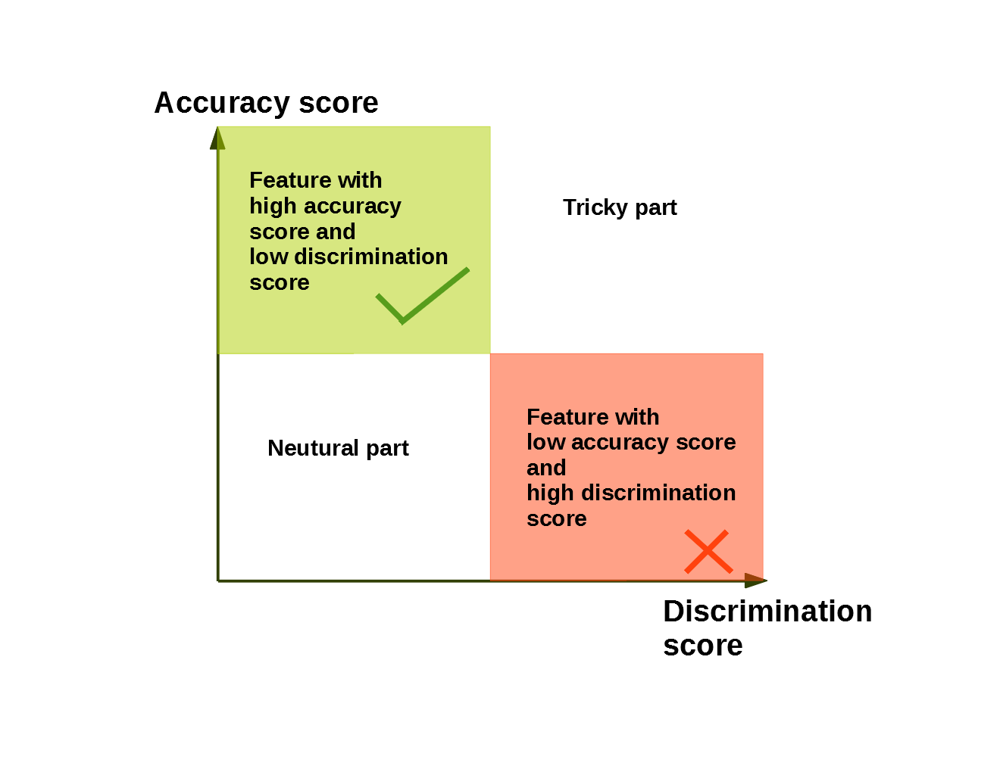

# Project 4: Machine Learning Fairness

### [Project Description](doc/project4_desc.md)

Term: Spring 2022

+ Team #11
+ Project title: Evaluating Machine Learning Bias Correction Algorithms: LM, LPS, and FFS
+ Team members
	+ Du, Christie
	+ Nallamaddi, Shriya
	+ Tang, Kexin
	+ Zhang, Xile
	+ Zheng, Haozhong
+ Project summary: In this project, we researched Machine Learning bias correction algorithms Conditional Discrimination as well as Fairness-aware Feature Selection. We implemented, evaluated, and compared LM, LPS, and FFS. Implementation and evaluation will be based on the COMPAS dataset, which contains the defendants' recidivsim risk score (COMPAS), race, gender, age, criminal history, prison time, etc. Our goal is to compare the performance and efficiency of the above algorithms for Machine Learning Fairness.

### [Algorithm](doc/):
+ **[A6: LM,LPS](doc/LM%2BLPS_model.ipynb)**
	
+ **[A7: FFS](doc/FFS.ipynb)**
	
	
**Contribution statement**:
+ Du, Christie: Project Leader, feature engineering, model selection, hyperparameter tuning, FFS research, FFS coding/development, evaluation metrics, data visualization, presentation
+ Nallamaddi, Shriya: FFS research, presentation
+ Tang, Kexin: Feature engineering, data cleaning, data processing, FFS research, presentation
+ Zhang Xile: Model selection, LM/LPS research, LM coding/development, LM/LPS evaluation metrics, data visualization, presentation
+ Zheng, Haozhong: LM/LPS research, LPS coding/development, algorithm diagram, presentation

Following [suggestions](http://nicercode.github.io/blog/2013-04-05-projects/) by [RICH FITZJOHN](http://nicercode.github.io/about/#Team) (@richfitz). This folder is organized as follows.

```
proj/
├── lib/
├── data/
├── doc/
├── figs/
└── output/
```

Please see each subfolder for a README file.
