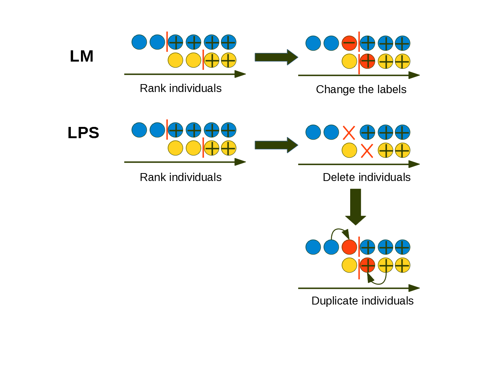

### Doc folder

The doc directory contains the report or presentation files. It can have subfolders. 

`data_cleaning.ipynb` - notebook to clean and process data

`feature_model_dev.ipynb` - notebook for feature engineering and model selection/hyperparameter tuning

### LM, LPS

`LM+LPS_model.ipynb` - notebook for LM/LPS development and evaluation

***

### FFS

`run_ffs.py` - script to run the FFS on our 6 chosen features

`FFS.ipynb` - notebook to evaluate the results of FFS

